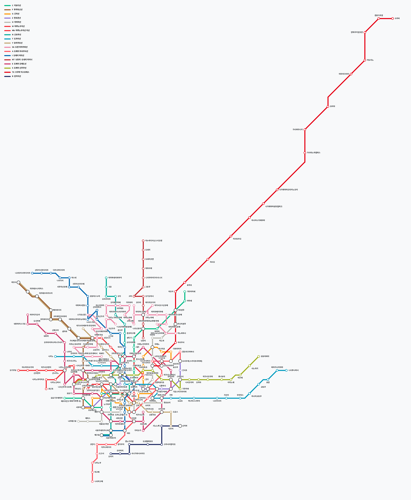

# 일본 지하철 도착 (jp-subway-now)

일본 지하철의 **시간표 + 실시간 지연·운행정보**를 조합해 한국 앱처럼 **"N분 후 도착"** 으로 보여주는 안드로이드 앱입니다.
노선도는 지역별로 새로 그린 도식 노선도이며, 모든 역명을 **한글**로 표기합니다. 시간표 기반 **최적 경로 검색**을 지원합니다.

> 비공식 개인 프로젝트입니다. 데이터는 공공교통 오픈데이터센터(ODPT)에서 제공받으며 정확성을 보증하지 않습니다. 자세한 내용은 [NOTICE.md](NOTICE.md)를 참고하세요.

## 주요 기능
| 기능 | 설명 | 구현 |
|---|---|---|
| N분 후 도착 | 예정 도착 = 시간표 + 실시간 지연. 열차 위치로 "전역 출발 / 전역 도착 / 곧 도착" 판정, 첫차·막차 표시 | `domain/arrival/ArrivalEstimator.kt` |
| 노선도 | 좌표 → 8방향 도식화, 역 간격 균일화, 겹치는 구간 평행선, 확대해도 글자 크기 고정 | `tools/layout_schematic.py`, `ui/map/` |
| 한글 역명 | ODPT 한국어 표기 → 수동 보정표 → 가나 자동 변환 순으로 적용 | `core/i18n/KanaToHangul.kt`, `tools/seed/ko_overrides.csv` |
| 최적 경로 | RAPTOR 알고리즘. 최단시간 / 최소환승을 한 번에 계산, 다음 열차 대안 | `domain/routing/Raptor.kt` |
| 역 검색 | 초성(ㅅㅈㅋ), 일본어, 영문, 역번호(G09) | `ui/search/` |
| 데모 모드 | ODPT 토큰이 없으면 가상 시간표로 동작 | `data/demo/DemoTimetableSource.kt` |

화면 흐름: 노선도 → 역 탭 → 바텀시트(출발 / 도착 / 도착정보) → 방면별 도착 카드 → 경로 결과(최단시간 / 최소환승 탭)

## 수록 노선 (v0.2.0)

총 23개 노선 · 458개 역 (노선별 역 수 합계)

| 지역 | 코드 | 노선 | 역 | 데이터 |
|---|---|---|---|---|
| 도쿄 | C | 지요다선 | 20 | ODPT |
| 도쿄 | F | 후쿠토신선 | 16 | ODPT |
| 도쿄 | G | 긴자선 | 19 | ODPT |
| 도쿄 | Z | 한조몬선 | 14 | ODPT |
| 도쿄 | H | 히비야선 | 22 | ODPT |
| 도쿄 | M | 마루노우치선 | 25 | ODPT |
| 도쿄 | Mb | 마루노우치선 지선 | 4 | ODPT |
| 도쿄 | N | 난보쿠선 | 19 | ODPT |
| 도쿄 | T | 도자이선 | 23 | ODPT |
| 도쿄 | Y | 유라쿠초선 | 24 | ODPT |
| 도쿄 | SA | 도덴 아라카와선 | 30 | ODPT |
| 도쿄 | A | 도에이 아사쿠사선 | 20 | ODPT |
| 도쿄 | I | 도에이 미타선 | 27 | ODPT |
| 도쿄 | NT | 닛포리·도네리 라이너 | 13 | ODPT |
| 도쿄 | E | 도에이 오에도선 | 38 | ODPT |
| 도쿄 | S | 도에이 신주쿠선 | 21 | ODPT |
| 도쿄 | TX | 쓰쿠바 익스프레스 | 20 | ODPT |
| 도쿄 | R | 린카이선 | 8 | ODPT |
| 요코하마 | B | 요코하마 블루라인 | 32 | ODPT |
| 요코하마 | G | 요코하마 그린라인 | 10 | ODPT |
| 다마 | TT | 다마 모노레일 | 19 | ODPT |
| 오사카 | M | 미도스지선 | 20 | 데모 시간표 |
| 오사카 | C | 주오선 | 14 | 데모 시간표 |

- 실시간 열차 위치: 도에이·요코하마 시영 (ODPT 제공 범위). 도쿄메트로 등은 시간표 + 운행정보 기준.
- JR·사철은 ODPT 일반 API 에 좌표·시간표가 없어 미수록.
- 노선 데이터 갱신: Actions → *Update network from ODPT* 수동 실행. 중계 서버: [docs/PROXY.md](docs/PROXY.md)

## 빠른 시작
1. ODPT 개발자 사이트(developer.odpt.org)에서 무료 토큰을 발급받습니다.
2. `local.properties.example`을 `local.properties`로 복사하고 `sdk.dir`, `odpt.consumerKey`를 채웁니다. (토큰 없이도 데모 모드로 실행됩니다. 앱 설정 화면에서 토큰을 입력해도 됩니다.)
3. Android Studio(Ladybug 이상, JDK 17)로 폴더를 엽니다. Gradle Wrapper가 자동 생성됩니다.
4. `app` 구성을 실행합니다.

명령줄: `gradle wrapper --gradle-version 8.11.1` 후 `./gradlew testDebugUnitTest assembleDebug`

## GitHub 등록과 릴리즈
1. 저장소를 만들고 이 폴더 전체를 push 합니다.
2. Actions 탭에서 **Gradle Wrapper** 워크플로를 한 번 수동 실행하면 `gradlew`와 wrapper jar가 커밋됩니다.
3. Settings → Secrets and variables → Actions에 아래 값을 등록합니다.

| Secret |
|---|
| `ANDROID_KEYSTORE_BASE64` |
| `ANDROID_KEYSTORE_PASSWORD` |
| `ANDROID_KEY_ALIAS` |
| `ANDROID_KEY_PASSWORD` |
| `ODPT_CONSUMER_KEY` |

4. `git tag v0.1.0 && git push origin v0.1.0` → **Release** 워크플로가 서명된 APK·AAB·SHA256SUMS를 GitHub Release에 올립니다.

자세한 내용: [docs/RELEASE.md](docs/RELEASE.md)

## 문서
- [ARCHITECTURE.md](docs/ARCHITECTURE.md) 전체 구조
- [ARRIVAL_ALGORITHM.md](docs/ARRIVAL_ALGORITHM.md) 도착 시간 계산
- [ROUTING.md](docs/ROUTING.md) 경로 탐색
- [MAP_DESIGN_GUIDE.md](docs/MAP_DESIGN_GUIDE.md) 노선도 설계
- [KOREAN_NAMING.md](docs/KOREAN_NAMING.md) 역명 한글 표기
- [DATA_SOURCES.md](docs/DATA_SOURCES.md) 데이터 출처
- [RELEASE.md](docs/RELEASE.md) 릴리즈

## 라이선스
코드는 [MIT](LICENSE). 데이터 이용 조건은 [NOTICE.md](NOTICE.md). UI는 국내 지하철 앱의 사용 흐름을 참고했으나 특정 회사의 명칭·로고·디자인 자산은 사용하지 않습니다.
